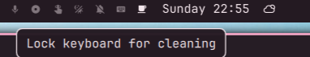

# omaClean — Keyboard Lock for Cleaning

A service plugin for [Omarchy](https://omarchy.org/) that locks keyboard input so you can wipe down your screen and keyboard safely without triggering keystrokes.

[](https://omarchyplugins.com)
[](LICENSE)



---

## Features

- **One-Click Keyboard Lock**: Click the indicator to disable keyboard input via `hyprctl` — no keystrokes get through while cleaning.
- **Click to Unlock**: Click the indicator again to re-enable the keyboard. Mouse still works while locked.
- **Persistent State**: Survives reboots — if you locked your keyboard before restarting, it stays locked on next boot.
- **Native Indicator**: Shows beside NightLight, StayAwake, and DnD in the indicators widget. Hides when inactive, reveals on hover — same behavior as the other indicators.

---

## Installation

Two steps. Copy-paste these into your terminal:

```bash
# Step 1 — install the service
omarchy plugin add https://github.com/JoeJoeflyn/omaclean --yes

# Step 2 — add the indicator to your bar
~/.config/omarchy/plugins/omaclean/setup.sh
```

Or tell your AI assistant (Devin, Claude, etc.):

> Install the omaClean Omarchy plugin from https://github.com/JoeJoeflyn/omaclean — run the plugin add command then the setup.sh script.

The setup script automatically:
1. Clones `omarchy.indicators` as `<username>.indicators` (e.g. `burninc0de.indicators`) if not already present
2. Copies `CleanKbd.qml` into it
3. Adds CleanKbd to the indicator list
4. Enables the service and restarts the shell

After install, hover the center bar section (around the clock) to reveal the keyboard icon beside NightLight and StayAwake. Click it to lock the keyboard, click again to unlock.

---

## Removal

```bash
omarchy plugin remove omaclean
omarchy plugin remove $(whoami).indicators  # e.g. burninc0de.indicators
omarchy restart shell
```

---

## License

MIT License © 2026 JoeJoeflyn
